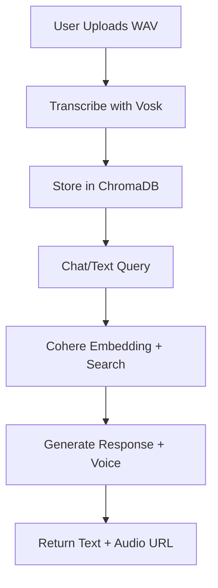

# 🫤 SwarSmriti – Preserving Memories with AI

> Voice your legacy. Immortalize memories. Speak to tomorrow.

## 🧠 Concept

**SwarSmriti** is an innovative AI-powered voice memory assistant designed to preserve and relive the voices and thoughts of loved ones. It allows users to:

* Train a voice agent with personal memories and sentiments.
* Interact with it via voice or text.
* Receive emotionally resonant responses in the cloned voice of the individual.

This project addresses the emotional void often left behind after a loved one is gone by creating a digital legacy — a personalized, voice-based AI that can comfort, converse, and preserve essence beyond life.

---

## 🛠️ Tech Stack

### 🖙 Backend

* **FastAPI**: High-performance backend framework.
* **Vosk**: Lightweight offline speech-to-text engine.
* **Python**: Core programming language.
* **Uvicorn**: ASGI server for FastAPI.
* **ChromaDB**: Vector database for memory embeddings.
* **Cohere API**: For semantic embeddings and natural language understanding.
* **ElevenLabs API**: For realistic voice synthesis.
* **Render.com**: Deployment platform.

### 🖜 Frontend

* **React.js + TypeScript**: Dynamic and typed frontend.
* **TailwindCSS**: Utility-first CSS framework.
* **Shadcn/UI**: Styled components library.
* **Recharts**: For memory visualizations.
* **Render.com (Static Site Hosting)**

---

## 🔥 Features

* 🎙️ Voice Memory Upload & Transcription
* 🧠 Memory Training via Vector Embedding
* 💬 Voice + Text Conversations with AI
* 🚣️ Realistic AI Voice Replies
* 📚 Memory Recall and Summary
* 💾 Persistent, personal memory bank

---

## 🚀 Live MVP & Demo

* 🌐 **Live Demo**: [https://swarsmriti-1.onrender.com](https://swarsmriti-1.onrender.com)
* 📽️ **Demo Video**: [YouTube Demo Link](https://youtu.be/your-demo-link) <!-- Replace with actual link -->

---

## 🧪 Setup & Build Instructions

### 🔧 Prerequisites

* Node.js >= 18
* Python >= 3.10
* pip / virtualenv
* Git

---

### 🛠️ Backend Setup (Arpit Makkar's Contribution)

1. **Clone Repo**

```bash
git clone https://github.com/your-username/swarsmriti.git
cd swarsmriti/backend
```

2. **Create Virtual Environment**

```bash
python -m venv venv
source venv/bin/activate  # Linux/macOS
venv\Scripts\activate     # Windows
```

3. **Install Dependencies**

```bash
pip install -r requirements.txt
```

4. **Run Locally**

```bash
uvicorn main:app --reload
```

5. **Directory Structure**

```
backend/
🏠
├── routes/                # API endpoints
├── vosk_transcriber.py    # Speech-to-text logic
├── main.py                # FastAPI app setup
├── memory.py              # ChromaDB integration
├── voice.py               # ElevenLabs integration
└── ...
```

---

### 🌐 Frontend Setup (Keshav Sharma's Contribution)

1. **Navigate to frontend folder**

```bash
cd ../frontend
```

2. **Install Dependencies**

```bash
npm install
```

3. **Set Environment Variable**

Update the backend API base URL in `src/services/api.ts`:

```ts
const API_BASE_URL = 'https://swarsmriti.onrender.com'; // ✅ Set to deployed backend
```

4. **Run Locally**

```bash
npm run dev
```

5. **Build for Production**

```bash
npm run build
```

6. **Deploy**

* Push the frontend code to GitHub
* Deploy static site via Render.com or Netlify
* Set build command: `npm run build`
* Set publish directory: `dist`

---

## 🢑 Team Roles

| Name              | Role                              | Contributions                                     |
| ----------------- | --------------------------------- | ------------------------------------------------- |
| **Arpit Makkar**  | Backend Integration & Deployment  | FastAPI APIs, Vosk STT, ElevenLabs, ChromaDB      |
| **Keshav Sharma** | Frontend Integration & Deployment | React UI, audio upload, API connectivity, hosting |

---

## 🧠 Memory Flow Diagram (Optional)



---

## 📌 Resources & Acknowledgements

* [Vosk API](https://alphacephei.com/vosk/)
* [Cohere](https://cohere.com/)
* [ElevenLabs](https://www.elevenlabs.io/)
* [Render Deployment](https://render.com/docs)

---

## 📬 Feedback or Questions?

Feel free to raise an issue or drop a message!
